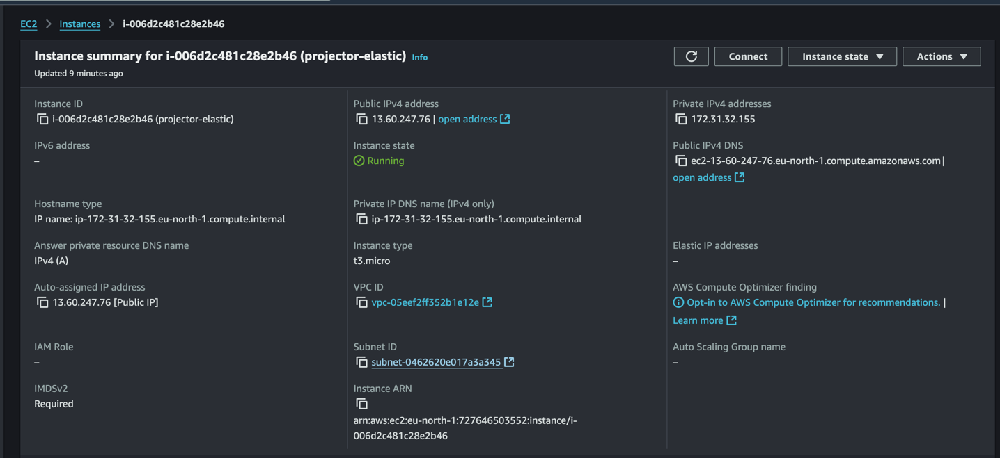
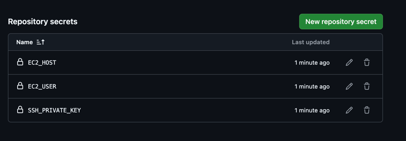
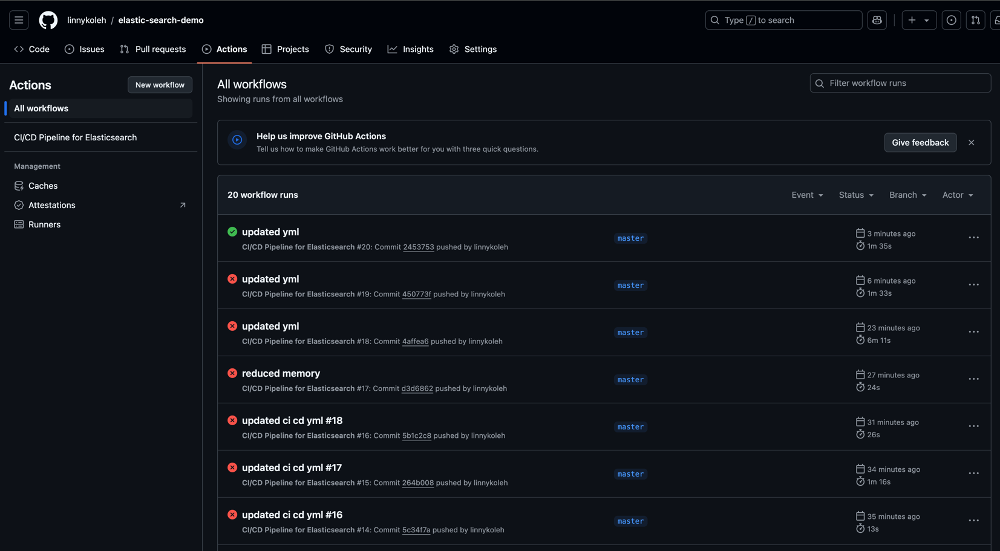
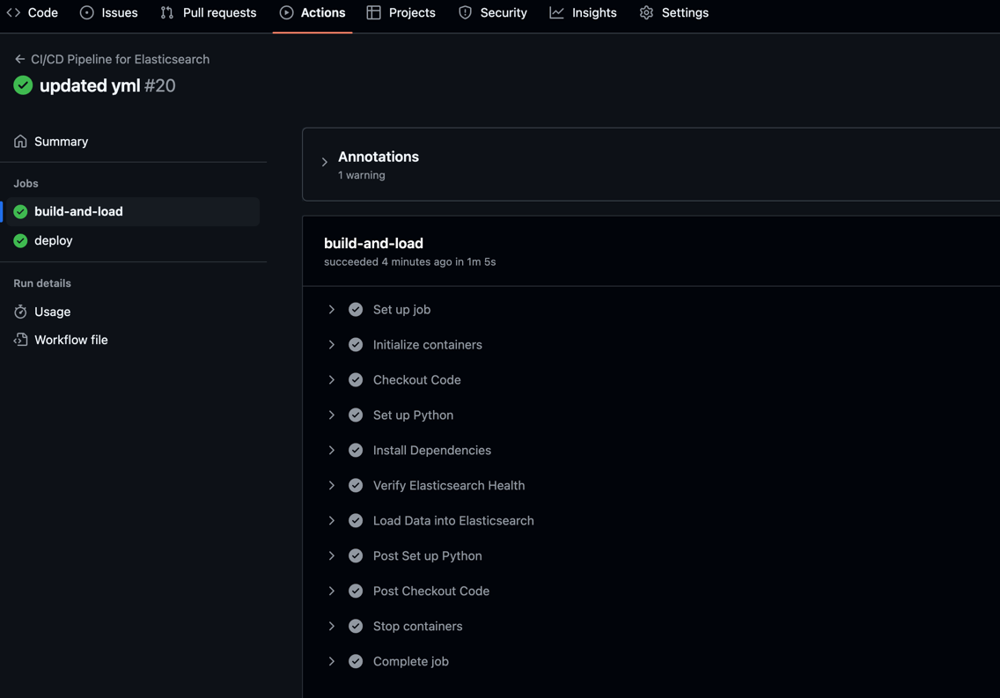
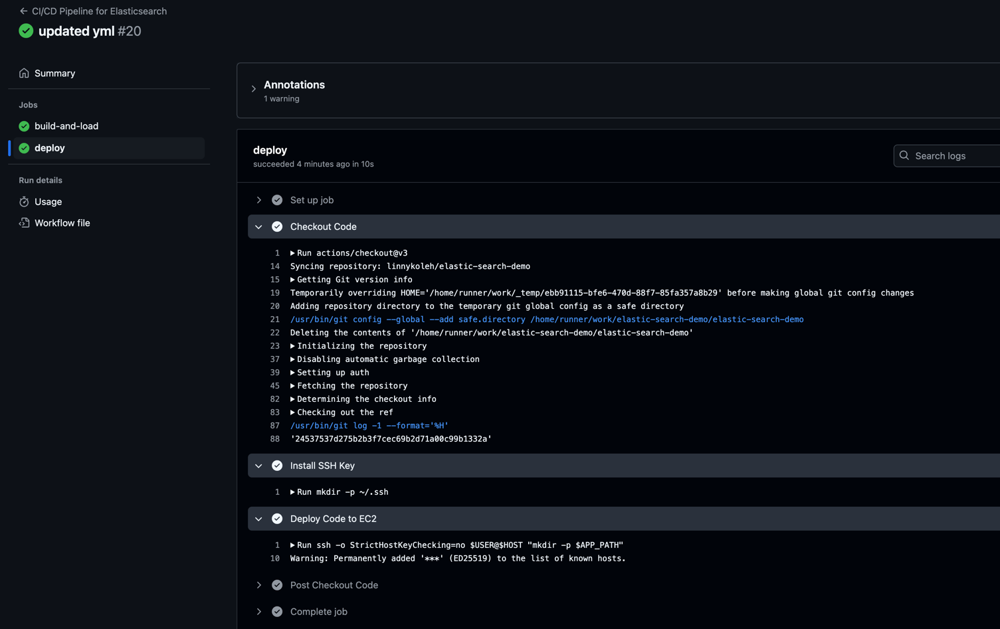
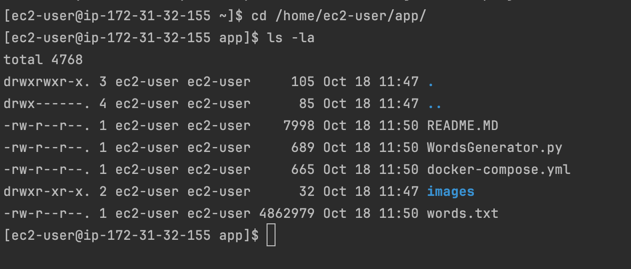

# Index & Autocomplete with Elasticsearch

## 1. Create docker-compose.yml

```yaml
version: '3.7'
services:
  elasticsearch:
    image: docker.elastic.co/elasticsearch/elasticsearch:7.17.10
    container_name: elasticsearch
    environment:
      - discovery.type=single-node
      - ES_JAVA_OPTS=-Xms512m -Xmx512m
    ports:
      - "9200:9200"
      - "9300:9300"
    volumes:
      - esdata:/usr/share/elasticsearch/data
    networks:
      - esnet

  kibana:
    image: docker.elastic.co/kibana/kibana:7.17.10
    container_name: kibana
    environment:
      - ELASTICSEARCH_HOSTS=http://elasticsearch:9200
    ports:
      - "5601:5601"
    networks:
      - esnet

volumes:
  esdata:
    driver: local

networks:
  esnet:
    driver: bridge
```

## 2. Run Elasticsearch and Kibana

```bash
docker-compose up -d
```

## 3. Create Index

```bash
curl -X PUT "localhost:9200/autocomplete_index?pretty" -H 'Content-Type: application/json' -d'
{
  "settings": {
    "analysis": {
      "filter": {
        "autocomplete_filter": {
          "type":     "edge_ngram",
          "min_gram": 2,
          "max_gram": 20
        }
      },
      "analyzer": {
        "autocomplete": {
          "type":      "custom",
          "tokenizer": "standard",
          "filter": [
            "lowercase",
            "autocomplete_filter"
          ]
        }
      }
    }
  },
  "mappings": {
    "properties": {
      "suggest_field": {
        "type": "text",
        "analyzer": "autocomplete",
        "search_analyzer": "standard"
      }
    }
  }
}
'
```

## 4. Add Data to Index autocomplete_index

```bash
from elasticsearch import Elasticsearch, helpers

# Initialize the Elasticsearch client
es = Elasticsearch(
    hosts=[{
        'host': 'localhost',
        'port': 9200,
        'scheme': 'http'
    }]
)

def generate_data(file_path):
    with open(file_path, 'r') as file:
        for line in file:
            word = line.strip()
            yield {
                "_index": "autocomplete_index",
                "_source": {
                    "suggest_field": word
                }
            }

helpers.bulk(es, generate_data('words.txt'))

print("Bulk insert complete.")
```

## 5. Search Data #1
 
### I will search for the word "machene" spelled incorrectly.

```bash
curl -X GET "localhost:9200/autocomplete_index/_search?pretty" -H 'Content-Type: application/json' -d'
{
  "query": {
    "match": {
      "suggest_field": {
        "query": "machene",
        "fuzziness": "AUTO",
        "prefix_length": 1,
        "max_expansions": 50
      }
    }
  }
}
'
```

### Here is a result:

```json
{
  "took" : 7,
  "timed_out" : false,
  "_shards" : {
    "total" : 1,
    "successful" : 1,
    "skipped" : 0,
    "failed" : 0
  },
  "hits" : {
    "total" : {
      "value" : 218,
      "relation" : "eq"
    },
    "max_score" : 22.795536,
    "hits" : [
      {
        "_index" : "autocomplete_index",
        "_type" : "_doc",
        "_id" : "fHluk5EBsBz0T2DqCFED",
        "_score" : 22.795536,
        "_source" : {
          "suggest_field" : "Machetes"
        }
      },
      {
        "_index" : "autocomplete_index",
        "_type" : "_doc",
        "_id" : "pXluk5EBsBz0T2DqCFED",
        "_score" : 22.795536,
        "_source" : {
          "suggest_field" : "machineable"
        }
      },
      {
        "_index" : "autocomplete_index",
        "_type" : "_doc",
        "_id" : "qXluk5EBsBz0T2DqCFED",
        "_score" : 22.795536,
        "_source" : {
          "suggest_field" : "machined"
        }
      },
      {
        "_index" : "autocomplete_index",
        "_type" : "_doc",
        "_id" : "rnluk5EBsBz0T2DqCFED",
        "_score" : 22.795536,
        "_source" : {
          "suggest_field" : "machineful"
        }
      },
      {
        "_index" : "autocomplete_index",
        "_type" : "_doc",
        "_id" : "tHluk5EBsBz0T2DqCFED",
        "_score" : 22.795536,
        "_source" : {
          "suggest_field" : "machineless"
        }
      },
      {
        "_index" : "autocomplete_index",
        "_type" : "_doc",
        "_id" : "tXluk5EBsBz0T2DqCFED",
        "_score" : 22.795536,
        "_source" : {
          "suggest_field" : "machinely"
        }
      },
      {
        "_index" : "autocomplete_index",
        "_type" : "_doc",
        "_id" : "tnluk5EBsBz0T2DqCFED",
        "_score" : 22.795536,
        "_source" : {
          "suggest_field" : "machinelike"
        }
      },
      {
        "_index" : "autocomplete_index",
        "_type" : "_doc",
        "_id" : "uHluk5EBsBz0T2DqCFED",
        "_score" : 22.795536,
        "_source" : {
          "suggest_field" : "machineman"
        }
      },
      {
        "_index" : "autocomplete_index",
        "_type" : "_doc",
        "_id" : "uXluk5EBsBz0T2DqCFED",
        "_score" : 22.795536,
        "_source" : {
          "suggest_field" : "machinemen"
        }
      },
      {
        "_index" : "autocomplete_index",
        "_type" : "_doc",
        "_id" : "u3luk5EBsBz0T2DqCFED",
        "_score" : 22.795536,
        "_source" : {
          "suggest_field" : "machinemonger"
        }
      }
    ]
  }
}
```

## 5. Search Data #2

```bash
curl -X GET "localhost:9200/autocomplete_index/_search?pretty" -H 'Content-Type: application/json' -d'
{
  "query": {
    "match": {
      "suggest_field": {
        "query": "oleh",
        "fuzziness": "AUTO",
        "prefix_length": 1,
        "max_expansions": 50
      }
    }
  }
}
'
```

### Here is a result:

```json
{
  "took": 4,
  "timed_out": false,
  "_shards": {
    "total": 1,
    "successful": 1,
    "skipped": 0,
    "failed": 0
  },
  "hits": {
    "total": {
      "value": 246,
      "relation": "eq"
    },
    "max_score": 27.968891,
    "hits": [
      {
        "_index": "autocomplete_index",
        "_type": "_doc",
        "_id": "Hnluk5EBsBz0T2DqC_7Z",
        "_score": 27.968891,
        "_source": {
          "suggest_field": "Oletha"
        }
      },
      {
        "_index": "autocomplete_index",
        "_type": "_doc",
        "_id": "H3luk5EBsBz0T2DqC_7Z",
        "_score": 27.968891,
        "_source": {
          "suggest_field": "Olethea"
        }
      },
      {
        "_index": "autocomplete_index",
        "_type": "_doc",
        "_id": "IHluk5EBsBz0T2DqC_7Z",
        "_score": 27.968891,
        "_source": {
          "suggest_field": "Olethreutes"
        }
      },
      {
        "_index": "autocomplete_index",
        "_type": "_doc",
        "_id": "IXluk5EBsBz0T2DqC_7Z",
        "_score": 27.968891,
        "_source": {
          "suggest_field": "olethreutid"
        }
      },
      {
        "_index": "autocomplete_index",
        "_type": "_doc",
        "_id": "Inluk5EBsBz0T2DqC_7Z",
        "_score": 27.968891,
        "_source": {
          "suggest_field": "Olethreutidae"
        }
      },
      {
        "_index": "autocomplete_index",
        "_type": "_doc",
        "_id": "sn9uk5EBsBz0T2DqSesa",
        "_score": 27.968891,
        "_source": {
          "suggest_field": "Oletha"
        }
      },
      {
        "_index": "autocomplete_index",
        "_type": "_doc",
        "_id": "s39uk5EBsBz0T2DqSesa",
        "_score": 27.968891,
        "_source": {
          "suggest_field": "Olethea"
        }
      },
      {
        "_index": "autocomplete_index",
        "_type": "_doc",
        "_id": "tH9uk5EBsBz0T2DqSesa",
        "_score": 27.968891,
        "_source": {
          "suggest_field": "Olethreutes"
        }
      },
      {
        "_index": "autocomplete_index",
        "_type": "_doc",
        "_id": "tX9uk5EBsBz0T2DqSesa",
        "_score": 27.968891,
        "_source": {
          "suggest_field": "olethreutid"
        }
      },
      {
        "_index": "autocomplete_index",
        "_type": "_doc",
        "_id": "tn9uk5EBsBz0T2DqSesa",
        "_score": 27.968891,
        "_source": {
          "suggest_field": "Olethreutidae"
        }
      }
    ]
  }
}
```

# Deploy to EC2 Instance with CI/CD github actions

## 1. Create a new EC2 instance



## 2. Create secret keys in the repository settings



## 3. Create a new file in the repository with the name .github/workflows/ci-cd.yml

```yaml
name: CI/CD Pipeline for Elasticsearch

on: push

jobs:
  build-and-load:
    runs-on: ubuntu-latest

    services:
      elasticsearch:
        image: docker.elastic.co/elasticsearch/elasticsearch:7.17.10
        ports:
          - 9200:9200
        options: >-
          --health-cmd="curl -f http://localhost:9200/_cluster/health || exit 1"
          --health-interval=5s
          --health-timeout=10s
          --health-retries=12
        env:
          discovery.type: single-node
          ES_JAVA_OPTS: "-Xms256m -Xmx256m"

    steps:
      - name: Checkout Code
        uses: actions/checkout@v3

      - name: Set up Python
        uses: actions/setup-python@v3
        with:
          python-version: '3.8'

      - name: Install Dependencies
        run: |
          python -m pip install --upgrade pip
          pip install elasticsearch

      - name: Verify Elasticsearch Health
        run: |
          curl -X GET "http://localhost:9200/_cluster/health?pretty"

      - name: Load Data into Elasticsearch
        run: |
          python WordsGenerator.py

  deploy:
    needs: build-and-load
    runs-on: ubuntu-latest

    steps:
      - name: Checkout Code
        uses: actions/checkout@v3

      - name: Install SSH Key
        run: |
          mkdir -p ~/.ssh
          echo "${{ secrets.SSH_PRIVATE_KEY }}" > ~/.ssh/id_rsa
          chmod 600 ~/.ssh/id_rsa

      - name: Deploy Code to EC2
        env:
          HOST: ${{ secrets.EC2_HOST }}
          USER: ${{ secrets.EC2_USER }}
          APP_PATH: ${{ secrets.APP_PATH }}
        run: |
          ssh -o StrictHostKeyChecking=no $USER@$HOST "mkdir -p $APP_PATH"
          scp -o StrictHostKeyChecking=no -r * $USER@$HOST:$APP_PATH
          ssh -o StrictHostKeyChecking=no $USER@$HOST "cd $APP_PATH && sudo systemctl restart projector_elastic.service"
```

## 4. CI/CD Pipeline

https://github.com/linnykoleh/elastic-search-demo/actions







## 5. Deployed to EC2 Instance

